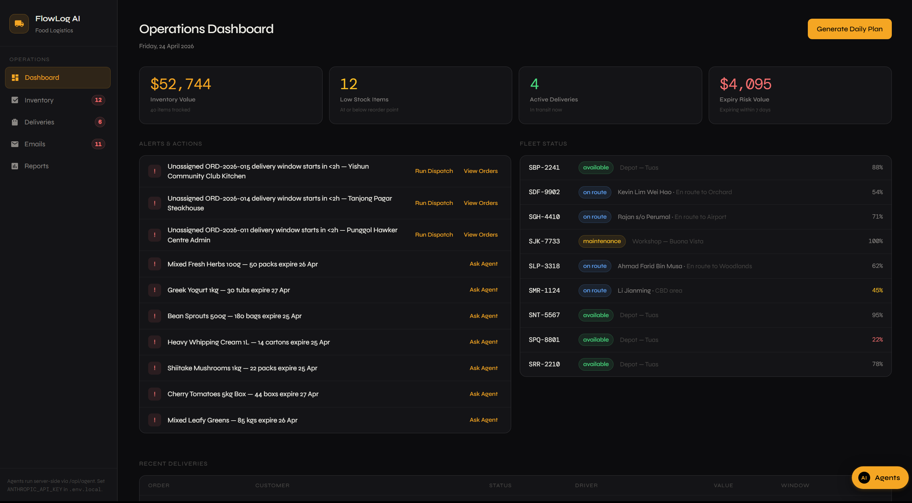

# FlowLog AI

**Live demo:** [anyhow-push-to-prod.vercel.app](https://anyhow-push-to-prod.vercel.app/)

An AI-powered food logistics operations console for **PrimeChill Distribution**, a Singapore-based food distribution company. FlowLog combines real-time operational data with Claude AI agents to manage inventory, deliveries, email triage, and daily planning — all from a single interface.



## What it does

FlowLog gives operations staff four core views:

- **Dashboard** — live alerts for stock outages, near-expiry items, and unread emails, plus KPI cards and a daily plan panel
- **Inventory** — stock levels, expiry batch tracking, reorder history, and category filtering
- **Deliveries** — order status pipeline from pending through delivery, with driver and vehicle assignment
- **Emails** — inbox triage with read/handled/draft/sent states, and customer/supplier categorization

An AI agent chat window floats over the UI and can query and mutate operational data via 15 tools. Four agent profiles handle different workflows:

| Profile | Role |
|---|---|
| General | Full-access operations brain |
| Inbox | Triages incoming email and drafts replies |
| Outbox | Proactive customer communications (ETAs, delay notices) |
| Dispatch | Delivery assignment and routing optimization |

## Tech stack

- **Framework:** Next.js 16 with React 19 (TypeScript)
- **Styling:** TailwindCSS 4 + CSS Modules
- **AI:** Anthropic Claude SDK — model `claude-sonnet-4-6` with prompt caching
- **State:** React Context + reducer (client-side, in-memory)
- **Package manager:** pnpm

## Getting started

**1. Install dependencies**

```bash
pnpm install
# or
npm install
```

**2. Set your Anthropic API key**

Create a `.env` file in the project root:

```
ANTHROPIC_API_KEY=sk-ant-...
```

You can also enter the API key directly in the sidebar once the app is running.

**3. Start the development server**

```bash
pnpm dev
# or
npm run dev
```

Open [http://localhost:3000](http://localhost:3000).

## Available scripts

| Command | Description |
|---|---|
| `pnpm dev` | Development server with hot reload |
| `pnpm build` | Production build |
| `pnpm start` | Production server |
| `pnpm lint` | Run ESLint |

## Project structure

```
app/
  page.tsx                  # Home page entry
  layout.tsx                # Root layout (fonts, metadata)
  flowlog.module.css        # All component styles
  api/
    agent/route.ts          # Claude agent endpoint
    plan/route.ts           # Daily planning endpoint
    sample/route.ts         # Sample data endpoint

components/flowlog/
  FlowLogApp.tsx            # Main app container
  Sidebar.tsx               # Navigation with alert badges
  FloatingAgentChat.tsx     # AI chat window
  tabs/                     # Dashboard, Inventory, Orders, Email tabs
  plan/                     # Daily plan panel

lib/flowlog/
  types.ts                  # Core TypeScript interfaces
  state.tsx                 # React context + reducer
  agent.ts                  # Agent orchestration
  agents/profiles.ts        # Agent system prompts
  tools.ts                  # Tool definitions
  toolHandlers.ts           # Tool execution logic
  sampleData.ts             # Mock data generator
  seed.ts                   # Initial data (20+ inventory items, fleet, suppliers)
  analytics.ts              # KPI computation
  planTypes.ts / planAdapter.ts / planChecks.ts  # Daily planning system
```

## Agent tools

Agents can call 15 tools to read and modify live application state:

`get_inventory` · `get_orders` · `get_fleet_status` · `get_analytics` · `update_stock_level` · `create_reorder` · `update_order_status` · `assign_delivery` · `list_emails` · `read_email` · `draft_email` · `draft_email_reply` · `mark_email_handled` · `send_email`

## Data model

All data is held in React state (no database). The seed file populates:

- **20 inventory items** across 6 categories: frozen meat, fresh produce, dry goods, dairy, beverages, packaging
- **Orders** with customer addresses, item lists, priorities, and delivery windows
- **Fleet** of 8+ drivers and 8+ vehicles with status and capacity tracking
- **9 suppliers** with lead times, reliability scores, and payment terms
- **Email inbox** with supplier and customer threads

## API endpoints

| Route | Description |
|---|---|
| `POST /api/agent` | Streams Claude agent responses with tool use and prompt caching |
| `POST /api/plan` | Generates a daily operations plan via Claude |
| `GET /api/sample` | Returns sample data for seeding |

Both AI routes accept an optional `x-api-key` header to use a user-supplied Anthropic key instead of the environment variable.
